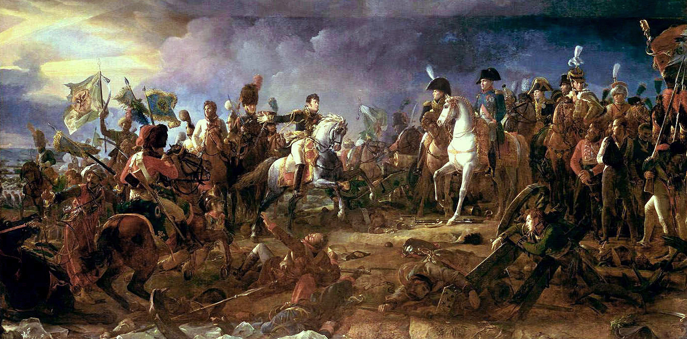
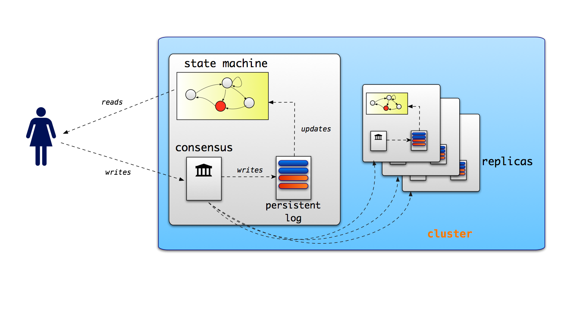
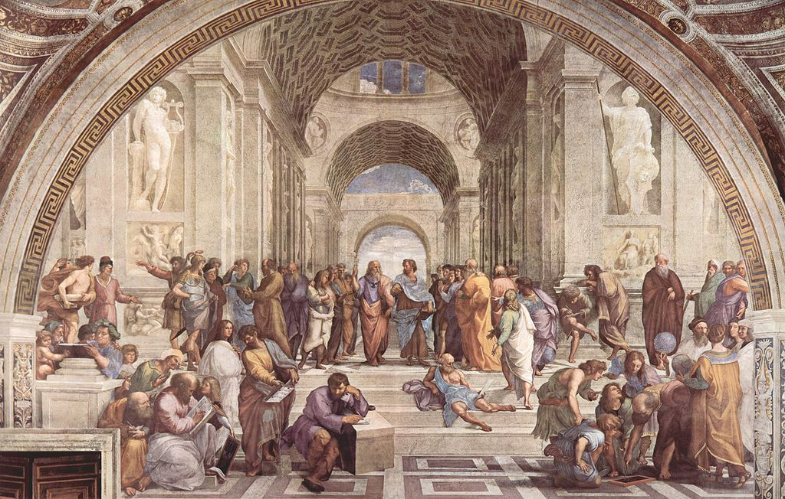

% Distributed Consensus for Dummies  
  The Raft Protocol
% Arnaud Bailly &lt;abailly@murex.com&gt;
% 2014-04

# How to Win Austerlitz? #

# The Rules #

* The emperor must coordinate its generals: If only some of its generals carry its orders, he loses everything!
* The emperor and its generals communicate with each other using *messengers* that carry orders
* The emperor issues one order to any general, either **attack** or **defend** 
* The goal is to ensure they **all** have the same order when asked to act, ie. they reach **consensus**

# Let's Try It! #

# Possible Assumptions #

There can be various assumptions on the way the generals and the emperor coordinates

* Messengers are *reliable*, ie. all messages are delivered and Generals are "perfect"
* Messengers are *unreliable*: They can be killed, diverted, messages can arrive in wrong order...
* Generals can be killed and not respond anymore
* There is a traitor!

# Basic Architecture

# Fundamental Impossibility Results #

-------------------------------------------------------------------------------

**In an Asynchronous Network...**

> It is not possible to reach distributed consensus with arbitrary communication failures
> 
> *Distributed Algorithms*, Nancy Lynch, 1997, Morkan-Kaufmann

-------------------------------------------------------------------------------

**In a Partially Synchronous Network...**

> It is possible to reach consensus assuming *f* processes fail and there is an upper bound *d* on delivery time for all messages, provided the
> number of processes is greater than *2f*
> 
> Nancy Lynch, op.cit.

# And in Practice? #

# Distributed Consensus is Hard... #

[The 8 Fallacies of Distributed Computing](https://en.wikipedia.org/wiki/Fallacies_of_Distributed_Computing)

1. The network is reliable.
2. Latency is zero.
3. Bandwidth is infinite.
4. The network is secure.
5. Topology doesn't change.
6. There is one administrator.
7. Transport cost is zero.
8. The network is homogeneous.

# ... but We Need It

* Distributed transactions coordination
    * ⟶ Several processes should agree on *commit* or *rollback* some operation
* Distributed Fault-Tolerant data stores (eg. ZooKeeper, Spanner)
* Distributed Locking (eg. Google's Chubby)

# Practical Consensus #

# The Leader: Paxos #

[The Part-Time Parliament](http://research.microsoft.com/en-us/um/people/lamport/pubs/lamport-paxos.pdf), *L.Lamport*

> Recent archaeological discoveries on the island of Paxos reveal that the parliament functioned de-
> spite the peripatetic propensity of its part-time legislators. The legislators maintained consistent
> copies of the parliamentary record, despite their frequent forays from the chamber and the forget-
> fulness of their messengers.

# Paxos Principles #

* Core algorithm is called *Single-Decree Synod* and describes how a single proposed value is accepted by the distributed
  processes
* Assumes non-Byzantine failures
* Extension to *multiple decrees*  is supposed to be straightforward but...
* ... Lamport omits a lot of details!

# Paxos Implementation #

> While Paxos can be described with a page of pseudo-code, our complete implementation contains several thousand lines of C++
> code. Converting the algorithm into a practical, production-ready system involved implementing many features and
> optimizations – some published in the literature and some not.

> [Paxos Made Live - An Engineering Perspective](www.read.seas.harvard.edu/~kohler/class/08w-dsi/chandra07paxos.pdf), T.Chandra et al.

# The Challenger: Raft #

* [In Search of an Understandable Consensus Algorithm](), D.Ongaro and J.Osterhout, 2013
* Novel algorithm designed with *understandability* in mind
* Dozens of implementations in various language
* Most prominent use is currently Go version for [etcd](http://github.com/coreos/etcd) distributed configuration system in [CoreOS](http://coreos.com)

# Principles of Operation #

* *Leader-follower* based algorithm: Leader is the single entry point for all operations on the cluster
* Each instance is a  [Replicated state machine](https://dl.acm.org/citation.cfm?id=866204) whose state is uniquely determined by
  a linear *persistent log*
* Leader orchestrates *safe log replication* to its *followers*
* *(non-core)* Supports cluster membership changes w/o service interruption
* *(non-core)* Log compaction for efficient operations

# Leader Election

* A replica starts election of a new *term*  as a *candidate* after leader times-out
* Replicas vote for the candidate whose *log* is at least as up-to-date as theirs
* Candidate receiving majority of votes from other replicas becomes *leader*
* Leader starts sending *heartbeat*  messages to all followers

# Log Replication

* Leader receives arbitrary *log entries*  from client to update underlying *state machine*
* It sends messages to followers to ensure they replicate its own log
* Entries are applied only when they are *committed* which happens when a majority of replicas has the new entry in their logs
* Monotonicity of *term* indices ensures safety of committed entries when leader crashes or *split brain*  happens

# Java Implementation: Barge #

> [https://github.com/mgodave/barge](https://github.com/mgodave/barge) !

* OSS project started by [Dave Rusek](http://github.com/mgodave) with contributions from [Justin Santa Barbara](http://github.com/justinsb) and yours truly
* Still very young but usable, provides 2 transport methods: Raw TCP and HTTP
* Feature complete w.r.t base protocol but missing *cluster reconfiguration* and *log compaction* 
* Friendly (Apache 2.0) License, *Pull Requests* are welcomed

# Demo

# Questions?

# Credits 

* [Napoléon à Austerlitz](http://en.wikipedia.org/wiki/File:Austerlitz-baron-Pascal.jpg)
*
  [Retour vers le futur](http://series-tv.premiere.fr/News-Series/Raising-Hope-saison-3-Special-Retour-vers-le-futur-avec-Christopher-Lloyd-3527734)
* [L'Académie](http://upload.wikimedia.org/wikipedia/commons/thumb/6/68/Raffael_058.jpg/1024px-Raffael_058.jpg)
* [Nancy Lynch at CSAIL](http://people.csail.mit.edu/lynch/)
